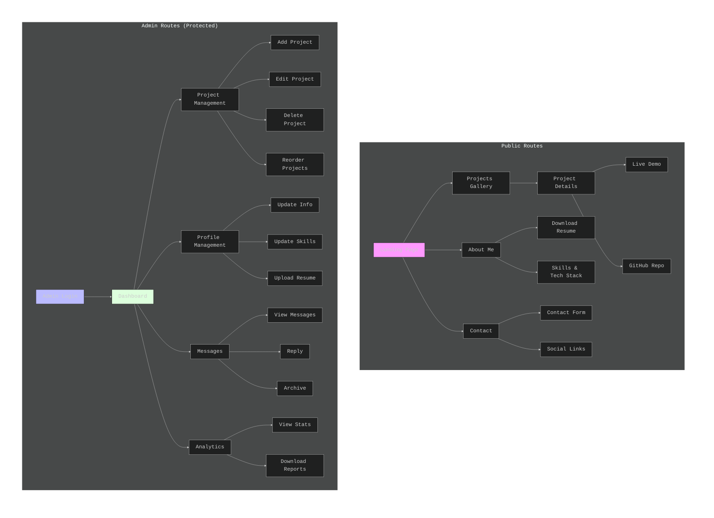

# Site Navigation

```mermaid
%%{init: {
  'theme': 'dark',
  'themeVariables': { 
    'fontSize': '24px',
    'fontFamily': 'monospace'
  },
  'flowchart': {
    'diagramPadding': 100,
    'nodeSpacing': 100,
    'rankSpacing': 100,
    'curve': 'basis'
  },
  'height': 1000,
  'width': 2000
}}%%
flowchart TD
    subgraph Public["Public Routes"]
        A[Landing Page] --> B[Projects Gallery]
        A --> C[About Me]
        A --> D[Contact]
        
        B --> E[Project Details]
        E --> F[Live Demo]
        E --> G[GitHub Repo]
        
        C --> H[Download Resume]
        C --> I[Skills & Tech Stack]
        
        D --> J[Contact Form]
        D --> K[Social Links]
    end

    subgraph Admin["Admin Routes (Protected)"]
        L[Admin Login] --> M[Dashboard]
        
        M --> N[Project Management]
        N --> N1[Add Project]
        N --> N2[Edit Project]
        N --> N3[Delete Project]
        N --> N4[Reorder Projects]
        
        M --> O[Profile Management]
        O --> O1[Update Info]
        O --> O2[Update Skills]
        O --> O3[Upload Resume]
        
        M --> P[Messages]
        P --> P1[View Messages]
        P --> P2[Reply]
        P --> P3[Archive]
        
        M --> Q[Analytics]
        Q --> Q1[View Stats]
        Q --> Q2[Download Reports]
    end

    style A fill:#f9f,stroke:#333,stroke-width:2px
    style L fill:#bbf,stroke:#333,stroke-width:2px
    style M fill:#dfd,stroke:#333,stroke-width:2px
```