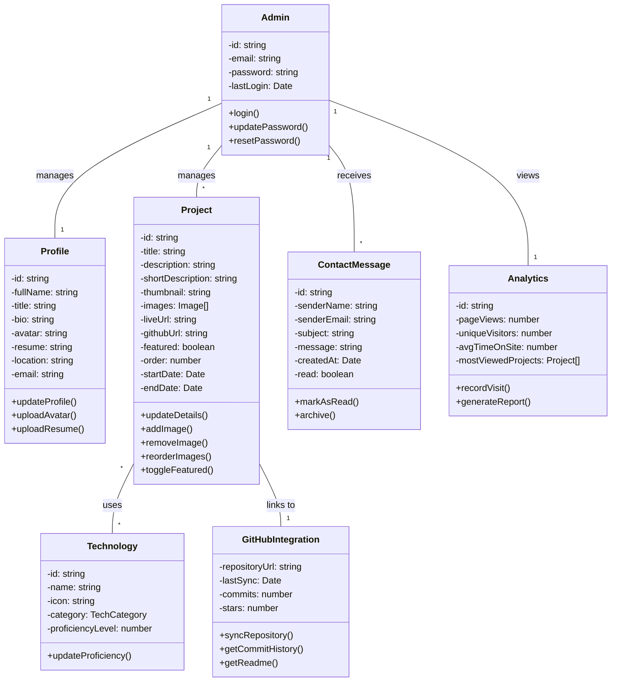

# Class Diagram

```mermaid

classDiagram
    class Admin {
        -id: string
        -email: string
        -password: string
        -lastLogin: Date
        +login()
        +updatePassword()
        +resetPassword()
    }

    class Profile {
        -id: string
        -fullName: string
        -title: string
        -bio: string
        -avatar: string
        -resume: string
        -location: string
        -email: string
        +updateProfile()
        +uploadAvatar()
        +uploadResume()
    }

    class Project {
        -id: string
        -title: string
        -description: string
        -shortDescription: string
        -thumbnail: string
        -images: Image[]
        -liveUrl: string
        -githubUrl: string
        -featured: boolean
        -order: number
        -startDate: Date
        -endDate: Date
        +updateDetails()
        +addImage()
        +removeImage()
        +reorderImages()
        +toggleFeatured()
    }

    class Technology {
        -id: string
        -name: string
        -icon: string
        -category: TechCategory
        -proficiencyLevel: number
        +updateProficiency()
    }

    class ContactMessage {
        -id: string
        -senderName: string
        -senderEmail: string
        -subject: string
        -message: string
        -createdAt: Date
        -read: boolean
        +markAsRead()
        +archive()
    }

    class GitHubIntegration {
        -repositoryUrl: string
        -lastSync: Date
        -commits: number
        -stars: number
        +syncRepository()
        +getCommitHistory()
        +getReadme()
    }

    class Analytics {
        -id: string
        -pageViews: number
        -uniqueVisitors: number
        -avgTimeOnSite: number
        -mostViewedProjects: Project[]
        +recordVisit()
        +generateReport()
    }

    Admin "1" -- "1" Profile : manages
    Admin "1" -- "*" Project : manages
    Project "*" -- "*" Technology : uses
    Project "1" -- "1" GitHubIntegration : links to
    Admin "1" -- "*" ContactMessage : receives
    Admin "1" -- "1" Analytics : views
```
    